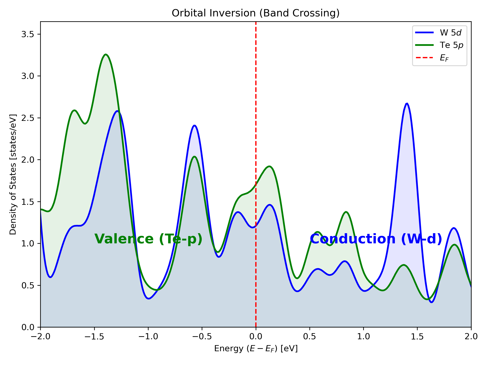
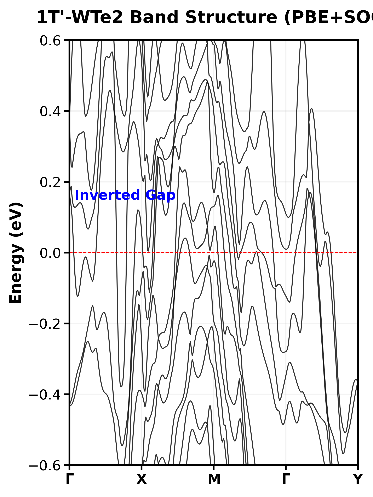

# Physics of the Quantum Spin Hall State in 1T'-WTe₂

## 1. Topological Origin: The Band Inversion Mechanism
The non-trivial topology in 1T'-WTe₂ originates from a fundamental band inverson between the cation $d$-orbitals and anion $p$-orbitals, driven by the interplay of crystal symmetry breaking and relativistic Spin-Orbit Coupling (SOC).

### 1. Structural Peierls Instability
The 1T' phase emerges from a spontaneous Peierls distortion of the high-symmetry 1T structure. This lowers the crystal symmetry (typically to $P2_1/m$), enabling the mixing of states that would otherwise be forbidden.

*Fig 1: Crystal lattice showing the characteristic zigzag tungsten chains induced by the Peierls distortion.*

### 2. Parity Exchange & Band Inversion
The distortion causes the W-$5d$ band manifold to dip energetically below the Te-$5p$ manifold. This "inverted" regime is the precursor to the topological phase.

*Fig 2: Projected Density of States (PDOS) illustrating the orbital hybridization near the Fermi energy ($E_F$).*

### 3. Relativistic Gap Opening
While the band inversion exists in the scalar-relativistic limit, the system remains a metal. It is the strong Spin-Orbit Coupling (SOC) of the heavy Tungsten atoms that lifts the degeneracy at the crossing points, opening a continuous gap across the Brillouin Zone (direct gap > 0).

*Fig 3: Relativistic electronic structure. The continuous gap opening at the band inversion points ($\Gamma$) generates the $Z_2=1$ topology.*
